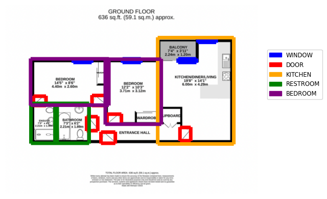

# :house: Floorplan Interpreter

This repo contains code needed to create the training data and train an image segmentation model to recognise certain parts of floorplans. We apply these trained models to a dataset of floor plans in order to estimate how many rooms, different room types, windows and doors they have.

  

## Setup

- Meet the data science cookiecutter [requirements](http://nestauk.github.io/ds-cookiecutter/quickstart), in brief:
  - Install: `direnv` and `conda`
- Run `make install` to configure the development environment:
  - Setup the conda environment
  - Configure `pre-commit`
  - Set-up Metaflow `export METAFLOW_PROFILE=floorplan` and `direnv reload`
  - Make sure your `METAFLOW_USER` name has no fullstops in.

## :file_folder: Pipeline

Please refer to the [README in the pipeline folder](asf_floorplan_interpreter/pipeline/README.md) for more information.

## Contributor guidelines

[Technical and working style guidelines](https://github.com/nestauk/ds-cookiecutter/blob/master/GUIDELINES.md)

---

<small>
Project based on <a target="_blank" href="https://github.com/nestauk/ds-cookiecutter">Nesta's data science project template</a>
(<a href="http://nestauk.github.io/ds-cookiecutter">Read the docs here</a>).
</small>
