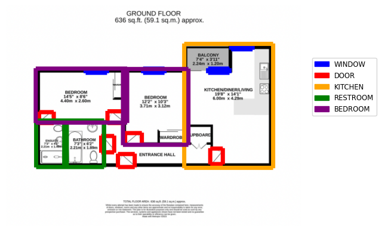

# :house: Floorplan Interpreter

In this directory is the code to:

- Create floorplan labelling tasks - see [the Prodigy folder README](annotation/README.md)
- Train a model to predict segments in floorplans
  - [Training datasets used](#training-data)
  - [Training](#muscle-training)
- Use these models to [predict segments](#-high-level-usage)
- Evaluate the pipeline - see [the evaluation folder README](evaluation/README.md)

## 🔨 High level usage

You can quickly load the trained models and make predictions on a floor plan url or local directory using the following code:

```
from asf_floorplan_interpreter.pipeline.predict_floorplan import FloorplanPredictor

img = 'outputs/figures/floorplan.png' # Local directory or a URL to an image file

fp = FloorplanPredictor(labels_to_predict = ["WINDOW", "DOOR","KITCHEN", "LIVING", "RESTROOM", "BEDROOM", "GARAGE"])
fp.load(local=True)
labels, label_counts = fp.predict_labels(img, conf_threshold=0)
fp.plot(img, labels, "outputs/figures/floorplan_prediction.png", plot_label=False)

```

`label_counts` will give the counts of each label, in this case `{'DOOR': 6, 'WINDOW': 4, 'KITCHEN': 1, 'RESTROOM': 2, 'BEDROOM': 2}`.

The image created will look like the following.

<p align="center">
  
</p>

You can tweak the `conf_threshold` argument to only output labels with a higher confidence in the predicted result.

In the above example, running `labels, label_counts = fp.predict_labels(img, conf_threshold=0.5)` gives 1 fewer window (the window to the balcony was removed).

## Training data

### 🤖 Roboflow data

There is [an existing annotation dataset of UK floorplans](https://universe.roboflow.com/prop/room-separation-instance/dataset/5) on Roboflow. This consists of:

- Training = 1454 images
- Validation = 65 images
- Test = 54 images

This dataset contains polygon annotations with 6 classes including "Door", "Double door","Folding door", "Room", "Sliding door", "Window".

This dataset is stored on S3 in the `/data/roboflow_data/` folder.

After an initial check we felt like the window and door labels were good and useful, but the room labels did not meet our needs.

### 💥 Our own labelled data

We also created datasets of labelled data using Prodigy - see more about this process in [the Prodigy folder README](asf_floorplan_interpreter/pipeline/annotation/README.md). The latest for these are stored in the S3 location `/data/annotation/prodigy_labelled/211123/`, and include:

1. Labelling rooms (`room_dataset.jsonl`).
2. Labelling doors, windows and staircases (`window_door_staircase.jsonl`).
3. Labelling room types from the room labels (`room_type_dataset.jsonl`).

To use this data to train a YOLO model we needed to format the data in a different way, and also to store the data in a specific folder structure - where the train/test/validation datasets are split out into different folders.

Thus, to convert these Prodigy labels to format needed for YOLO, run:

```
python asf_floorplan_interpreter/pipeline/prodigy_to_yolo.py
```

This will output the images and the labels in the S3 sub directory `data/annotation/prodigy_labelled/211123/yolo_formatted/` for each dataset.

### :file_folder: Roboflow plus our own labelled data for windows and doors

Since the Roboflow data for windows and doors was useful, we decided to merge this with the data we'd already labelled using Prodigy. This can be done by running:

```
python asf_floorplan_interpreter/pipeline/merge_prodigy_roboflow.py
```

This will output data to `data/annotation/prodigy_labelled/131123/yolo_formatted/window_door_prodigy_plus_roboflow` and will take some time to run.

Any other classes other than windows and doors will be removed from this particular labelled dataset.

## :muscle: Training

The pre-trained YOLOv8m model for instance segmentation (docs) can be trained with our newly annotated data using metaflow, by running:

```
cd asf_floorplan_interpreter/pipeline/
python train_yolo.py --package-suffixes=.txt,.yaml,.jpg --datastore=s3 run --config_file configs/CONFIG_NAME.yaml
```

This will train the model and output the best model in the S3 location `/models/CONFIG_NAME/`.

If you want to get the model and the evaluation files locally from a model you have trained run:

```
aws s3 sync s3://asf-floorplan-interpreter/models/{MODEL_NAME}/ models/{MODEL_NAME}/

```

where `MODEL_NAME` will be the name of the config file you used to train the model, plus any suffix that was given in this config, e.g. `window_door_config_yolov8m_wd`.

The metaflow files are in [this location](https://s3.console.aws.amazon.com/s3/buckets/open-jobs-lake?prefix=metaflow/FloorPlanYolo/&region=eu-west-1).

### 📓 Configs

Note that for Batch to work, the configs need to be in the same folder as `train_yolo.py` - hence why we store them in the `configs/` folder rather than elsewhere in this repo.

To train each model a pair of configs are needed; the main config (e.g. `room_config.yaml`) and the config neccessary for training using YOLO (`yolo_room_config.yaml`). The latter is referenced in the former, so when you run `train_yolo.py` you only need the first config in the argument.

The main configs to choose from are:

1. `configs/roboflow_config.yaml`: To train a model to identify doors, windows and rooms using the Roboflow dataset.
2. `configs/room_config.yaml`: To train a model that will identify rooms using our labelled dataset.
3. `configs/window_door_config.yaml`: To train a model that will identify windows, and doors using our labelled dataset plus that from Roboflow.
4. `configs/staircase_config.yaml`: To train a model to identify staircases
5. `configs/room_type_config.yaml`: To train a model to identify specific room types ("RESTROOM", "BEDROOM", "KITCHEN", "LIVING", "GARAGE", "OTHER")

There are also test versions of some of these which will run more quickly `configs/roboflow_test_config.yaml` and `configs/room_test_config.yaml`.

e.g.

```
python train_yolo.py --package-suffixes=.txt,.yaml,.jpg --datastore=s3 run --config_file configs/roboflow_test_config.yaml
```

The Yolo configs are in a specific format and include two variables which need setting according to your task. For example in the roboflow config:

```
path: "data/roboflow_data/"
train: images/train
val: images/val
test: images/test
save_dir: "roboflow_save_dir/"

nc: 6
names: ["DOOR", "DOUBLE DOOR", "FOLDING DOOR", "ROOM", "SLIDING DOOR", "WINDOW"]

```

we provide the paths to the training, test and validation sets (i.e. `data/roboflow_data/images/train` etc), as well as telling YOLO we want to train 6 class (`nc` = number of classes) and the names of these 6 classes (`names`). Yolo will then map each class to a number. The names of the classes should map to what's in the training datasets (i.e if class 2 was "folding door" then `names` should have folding door as the 2nd element.

### Trained models

The trained models we use in evaluation and prediction are the following:

- `models/window_door_config_yolov8m_wd/`
- `models/room_config_yolov8m/`
- `models/staircase_config_yolov8m/`
- `models/room_type_config_yolov8m/`

in each of these S3 locations the model file to use is in `weights/best.pt`.
